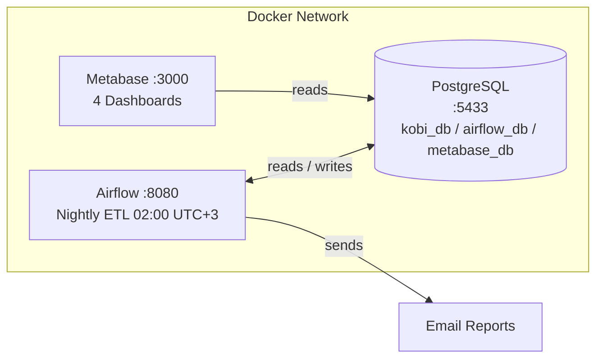

# LedgerFlow — Automated SMB Business Intelligence System

> Automated nightly BI reporting system for Turkish SMEs with accounting software integration and morning email delivery.

**Demo Scenario:** Yılmaz Makine Ltd. — Istanbul-based machinery manufacturing and sales company

---

## Features

- **Nightly automated ETL** (Airflow): Updates overdue invoices and calculates KPIs
- **7:00 AM email report**: Cash position, receivables tracking, and stock alerts in HTML format
- **4 Metabase Dashboards**: Cash Position, Sales Summary, Receivables Tracking, Executive Summary
- **Realistic demo data**: 18 months of seasonal sales fluctuation, 208 overdue receivables, 8 critical stock items
- **Docker Compose**: Single command to spin up the entire stack

---

## Architecture



**Data flow:**
1. Airflow reads from `kobi_db`, updates overdue statuses, and writes KPI snapshots back
2. Metabase reads from `kobi_db` to render live dashboards
3. Airflow sends HTML email reports via SMTP

### Database Schema
customers (15 records)
├── invoices (632 records, 38.7M TRY)
│       └── payments (406 payments, 23.6M TRY collected)
└── (views: overdue_receivables, critical_stock)
inventory (48 items)

---

## Quick Start

### Prerequisites

- Docker & Docker Compose
- Python 3.10+
- `pip install faker psycopg2-binary requests`

### Setup

```bash
# 1. Clone the repository
git clone https://github.com/MustafaAygunDs/ledgerflow.git
cd ledgerflow

# 2. Configure email settings (optional)
cp .env.example .env

# 3. Start all services
docker compose up -d

# 4. Create the database schema
docker cp scripts/01_schema.sql kobi-postgres:/tmp/
docker exec kobi-postgres psql -U kobi -d kobi_db -f /tmp/01_schema.sql

# 5. Load demo data
python3 scripts/02_seed_data.py

# 6. Configure Metabase
python3 scripts/03_metabase_setup.py

# 7. Test email report (no SMTP required)
python3 scripts/04_sabah_email.py --dry-run
```

---

## Services

| Service    | URL                   | Username                  | Password       |
|------------|-----------------------|---------------------------|----------------|
| Metabase   | http://localhost:3000 | admin@yilmazmakine.com.tr | KobiRapor2024! |
| Airflow    | http://localhost:8080 | admin                     | admin123       |
| PostgreSQL | localhost:5433        | kobi                      | kobi123        |

---

## Dashboards

### Cash Position
- Collected, pending, and overdue receivables scalar KPIs
- Monthly collection trend (line chart)
- Invoice status distribution (pie chart)

### Sales Summary
- 18-month sales bar chart (seasonal fluctuation visible)
- Top 10 customers ranking
- Sales distribution by industry sector
- Average invoice value trend

### Receivables Tracking
- Aging analysis: 1-30 / 31-60 / 61-90 / 91-180 / 180+ days
- High-risk customers table
- Overdue invoice list (top 50)

### Executive Summary
- Current month sales / collections / critical stock KPIs
- Sales vs. Collections comparison chart
- Critical stock list (items requiring reorder)
- Payment method distribution

---

## Airflow DAG

**Schedule:** Nightly at 02:00 Turkey time
db_health_check
|
update_overdue_status
|
+-- calculate_cash_position
+-- calculate_sales_summary
+-- track_receivables
+-- check_stock_alerts
|
send_email_report

| Task | Description |
|------|-------------|
| db_health_check | Verify database connectivity |
| update_overdue_status | Mark past-due invoices as overdue |
| calculate_cash_position | Cash KPIs for the last 30 days |
| calculate_sales_summary | Sales summary and top 5 customers |
| track_receivables | Overdue receivables aging analysis |
| check_stock_alerts | Detect items below minimum stock |
| send_email_report | Compile and send HTML email report |

---

## Email Report

```bash
SMTP_HOST=smtp.gmail.com
SMTP_PORT=587
SMTP_USER=your@gmail.com
SMTP_PASS=app-password
REPORT_EMAIL=manager@company.com
```

---

## Demo Data

| Metric | Value |
|--------|-------|
| Customers | 15 companies |
| Total Invoices | 632 invoices / 38.7M TRY |
| Amount Collected | 23.6M TRY |
| Overdue Receivables | 208 invoices / 9.6M TRY |
| Maximum Overdue | 518 days |
| Inventory Items | 48 items |
| Critical Stock | 8 items |

---

## Tech Stack

| Layer | Technology |
|-------|------------|
| Database | PostgreSQL 15 |
| Visualization | Metabase (Open Source) |
| Orchestration | Apache Airflow 2.9 |
| Data Generation | Python 3 + Faker |
| Email | Python smtplib |
| Container | Docker + Docker Compose |

---

## Real-World Integration

- **Logo Tiger / Go**: Direct MSSQL connection
- **Mikro**: PostgreSQL or MSSQL
- **Parasut / e-Logo**: REST API
- **Zirve**: DBF/SQL export

---

## License

MIT

*Mustafa Aygun — Data Engineer*
